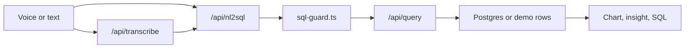

# VocalLytics

Voice-to-SQL analytics for Instacart order behavior. Users ask a question by voice or text, receive a guarded SQL query, and view the result as a chart with the underlying SQL.

## Features

- Voice or typed input with OpenAI or Groq speech transcription
- Schema-grounded SQL generation with structured Claude responses
- Read-only query execution with SQL parsing and table allowlists
- Plotly charts with the generated SQL shown alongside the result
- Summary tables for common order, department, product, and reorder-rate views
- Optional demo mode for local use without a live database
- CSV upload for single-table ad hoc datasets

## Architecture



The model never connects to the database. It returns a SQL string and chart spec. The application validates the SQL, applies query limits, and executes it through a read-only Postgres transaction.

## Tech Stack

| Layer | Technology |
| --- | --- |
| Frontend | Next.js 14, React 18, Tailwind CSS |
| Charts | Plotly |
| Database | PostgreSQL |
| NL-to-SQL | Anthropic Claude |
| Speech-to-text | OpenAI Whisper or Groq Whisper |
| Validation | Zod, node-sql-parser |
| Tests | Vitest |

## Dataset

The app targets the Instacart Market Basket Analysis dataset.

| Table | Description |
| --- | --- |
| `departments` | Grocery departments |
| `aisles` | Aisles within the store |
| `products` | Product catalog |
| `orders` | Order metadata |
| `order_items` | Product line items |
| `summary_orders_by_dow` | Orders by day of week |
| `summary_orders_by_hour` | Orders by hour of day |
| `summary_department_stats` | Department item volume and reorder rate |
| `summary_product_stats` | Product item volume and reorder rate |

Instacart does not include prices, revenue, profit, or calendar order dates. Supported metrics include order counts, item counts, basket behavior, and reorder rate.

## Quick Start

### Prerequisites

- Node.js 18+
- PostgreSQL for live data
- Anthropic API key
- OpenAI or Groq API key for voice input

### Install

```bash
npm install
```

### Environment

Copy `.env.example` to `.env.local` and set the values you need.

| Variable | Purpose |
| --- | --- |
| `DATABASE_URL` | Runtime Postgres connection |
| `SEED_DATABASE_URL` | Admin Postgres connection for import scripts |
| `ANTHROPIC_API_KEY` | SQL generation and insight generation |
| `OPENAI_API_KEY` | OpenAI transcription |
| `GROQ_API_KEY` | Groq transcription |
| `STT_PROVIDER` | `openai` or `groq` |
| `MAX_QUERY_COST` | Maximum allowed query plan cost |
| `DEMO_FALLBACK` | Use sample rows when the database is unavailable |
| `DEMO_MODE` | Use sample rows without attempting a database connection |

### Run

```bash
npm run dev
```

Open `http://localhost:3000`.

## Uploaded Datasets

The app supports CSV upload from the sidebar. Uploaded files are profiled locally, assigned safe column names, and stored as JSON under `backend/uploads/`. The uploaded dataset becomes selectable immediately and uses the same NL-to-SQL request flow.

The upload path is intentionally scoped:

- CSV only
- One table per uploaded dataset
- Maximum 8 MB per upload
- Maximum 5,000 stored rows
- Maximum 60 columns
- Supported query shape: `SELECT` from `uploaded_rows` with optional `GROUP BY`, `ORDER BY`, and `LIMIT`
- Supported aggregates: `COUNT`, `SUM`, `AVG`, `MIN`, `MAX`

Uploaded datasets do not create database tables. They run through a constrained in-process query executor for local analysis.

## Data Import

Place the Instacart CSV files in `backend/data/instacart/`, then run:

```bash
npm run import:instacart -- --items=train
```

Import modes:

| Flag | Approximate line items |
| --- | --- |
| `--items=train` | 1.3M |
| `--items=prior` | 32M |
| `--items=all` | 34M |

Rebuild summary tables:

```bash
npm run build:summaries
```

## Replacing the Dataset

Dataset-specific behavior is centralized in `backend/lib/dataset.ts`. To use a different database, replace the dataset configuration instead of editing the core API routes.

Update:

- `name`, `description`, and `unavailableConcepts`
- `tables` with table names, columns, and sample rows
- `glossary` with metric definitions and query preferences
- `retrievalRules` for selecting relevant tables from a question
- `exampleQuestions` for the UI
- `evalCases` for `npm run eval:nl2sql`
- `demoRows` for local sample responses

The SQL guard reads its allowlist from this config. Schema rendering, prompt grounding, example prompts, evaluation cases, and demo-mode responses all use the same dataset definition.

For a new dataset, create the database tables separately, update `DATABASE_URL`, and either write an import script for that dataset or load the data with your database tooling.

## Scripts

| Script | Description |
| --- | --- |
| `npm run dev` | Start the development server |
| `npm run build` | Build the production app |
| `npm run start` | Start the production server |
| `npm run typecheck` | Run TypeScript checks |
| `npm test` | Run unit tests |
| `npm run eval:nl2sql` | Run the NL-to-SQL evaluation cases |
| `npm run import:instacart` | Import Instacart CSV files |
| `npm run build:summaries` | Rebuild summary tables |
| `npm run seed:synthetic` | Load the legacy synthetic dataset |

## SQL Safety

Generated SQL is treated as untrusted input. The query route validates requests with Zod, parses SQL with `node-sql-parser`, allows only one `SELECT` statement, blocks writes and catalog access, enforces a table allowlist, rejects broad query patterns, and applies a maximum row limit. Query execution uses a read-only transaction and statement timeout.

The app also supports query-cost preflight with `EXPLAIN (FORMAT JSON)` before execution.

## Project Structure

```text
app/
  api/
  layout.tsx
  page.tsx
backend/
  data/
  db/
  evals/
  lib/
  scripts/
config/
frontend/
  components/
  pages/
  styles/
```

## Deployment

The app can run on Vercel with a hosted Postgres database. Set the same environment variables used locally. API routes require the Node.js runtime.

## License

MIT. Instacart data is subject to the source dataset terms.
